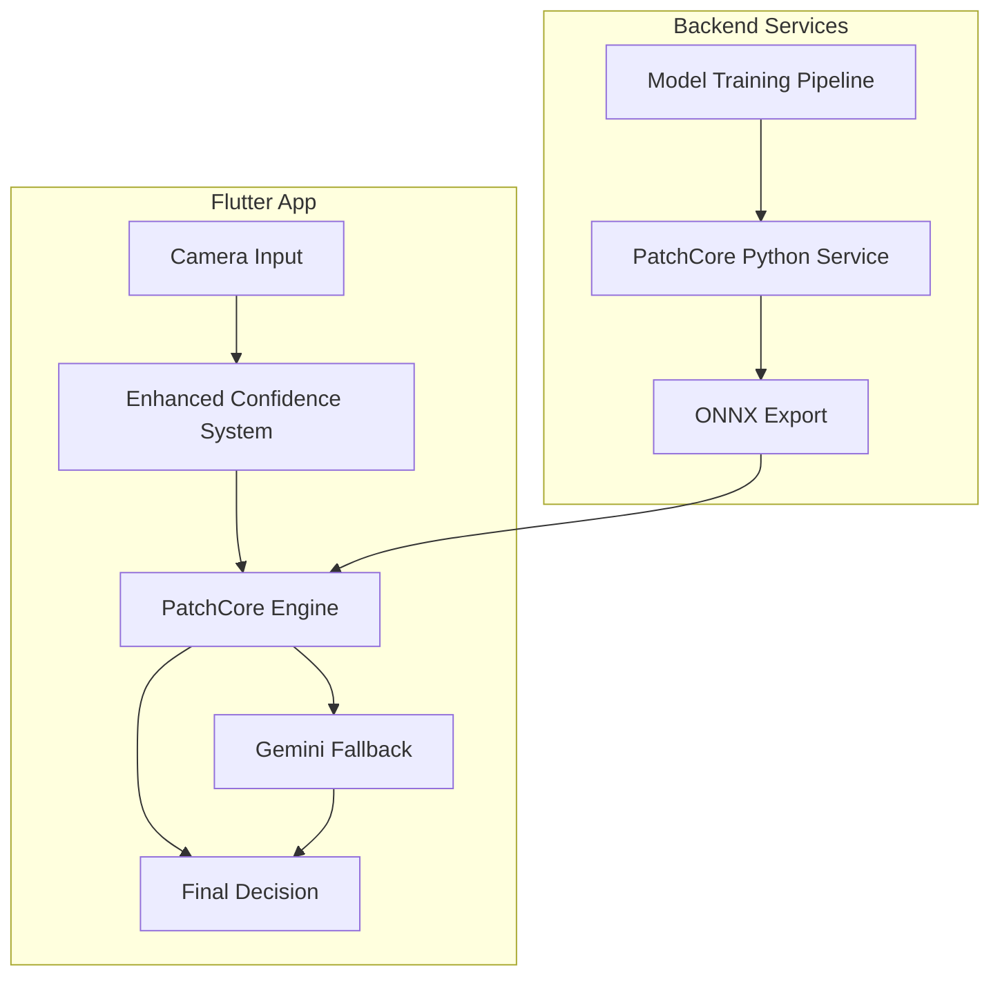

# PatchCore Integration Plan for Quality Control Mobile

## 📋 Executive Summary

Tento dokument popisuje plán integrace **PatchCore algoritmu** z Anomalib knihovny do stávající Flutter Quality Control Mobile aplikace. PatchCore je state-of-the-art řešení pro detekci anomálií v průmyslové kontrole kvality.

---

## 🎯 Současný Stav (Gemini Vision)

### ✅ Funkční systém:
- **Flutter Mobile App** s Gemini Vision API
- **Enhanced Confidence System** (5-factor scoring)
- **Pre-analysis kvalita snímků** (token saving 15-30%)
- **Smart Recommendations Engine**
- **User Feedback Collection**
- **Database persistence** (SQLite)

### 📊 Současná přesnost:
- Gemini Vision API: **~80-90%** přesnost
- Subjektivní AI interpretace
- Variabilní výsledky

---

## 🚀 PatchCore Výhody

### 🔬 Technické přednosti:
- **95-99%** přesnost v defect detection
- **Millisecond inference** vs seconds
- **Konzistentní výsledky** (deterministické)
- **Lokalizace defektů** s pixel-level precision
- **Single-class training** (pouze "OK" snímky)

### 💰 Business výhody:
- **Nižší false positive rate** → méně zbytečných zmetků
- **Rychlejší inspection** → vyšší throughput
- **Offline capability** → nezávislost na internetu
- **Customizace** pro specifické díly

---

## 🏗️ Integration Architecture

### **Hybridní Přístup (Doporučený)**



### **Integration Phases:**

#### **Phase 1: Proof of Concept (2-3 týdny)**
```python
# Python Backend Service
from anomalib.models import Patchcore
from anomalib.data import Folder

# Train model
model = Patchcore()
model.fit(datamodule)

# Export to ONNX
model.export(export_type="onnx")
```

#### **Phase 2: REST API Integration (1-2 týdny)**
```dart
// Flutter Service
class PatchCoreService {
  Future<AnomalyResult> detectAnomalies({
    required File referenceImage,
    required File partImage,
  }) async {
    final response = await http.post(
      Uri.parse('$baseUrl/detect'),
      body: {
        'reference': base64.encode(referenceImage.readAsBytesSync()),
        'part': base64.encode(partImage.readAsBytesSync()),
      },
    );
    
    return AnomalyResult.fromJson(response.data);
  }
}
```

#### **Phase 3: Edge Deployment (2-3 týdny)**
```dart
// ONNX Runtime Integration
class EdgePatchCoreService {
  late OnnxRuntimeSession _session;
  
  Future<void> initialize() async {
    final modelBytes = await rootBundle.load('assets/models/patchcore.onnx');
    _session = OrtSession.fromBuffer(modelBytes.buffer.asUint8List());
  }
  
  Future<AnomalyResult> runInference(Uint8List imageData) async {
    final inputs = {'input': OrtValueTensor.createTensorWithDataList(imageData)};
    final outputs = await _session.runAsync(OrtRunOptions(), inputs);
    return AnomalyResult.fromOnnxOutput(outputs);
  }
}
```

---

## 📱 Enhanced Mobile Architecture

### **Updated Service Layer:**

```dart
class EnhancedGeminiService {
  final PatchCoreService _patchCoreService;
  final GeminiService _geminiService;
  
  Future<EnhancedAnalysisResult> performEnhancedAnalysis({
    required File referenceImage,
    required File partImage,
    required PartType partType,
    required String userId,
  }) async {
    
    // 1. Pre-analysis (existing)
    final preAnalysis = await _confidenceService.evaluateImageQuality();
    
    // 2. PatchCore primary detection (NEW)
    final patchCoreResult = await _patchCoreService.detectAnomalies(
      referenceImage: referenceImage,
      partImage: partImage,
    );
    
    // 3. Decision logic
    if (patchCoreResult.confidence >= 0.95) {
      // High confidence PatchCore result
      return _createResultFromPatchCore(patchCoreResult);
    } else {
      // Fallback to Gemini for complex cases
      final geminiResult = await _geminiService.analyzeImages(
        referenceImage: referenceImage,
        partImage: partImage,
        partType: partType,
        patchCoreContext: patchCoreResult, // Enhanced context
      );
      
      return _combineResults(patchCoreResult, geminiResult);
    }
  }
}
```

---

## 🎛️ Model Training Strategy

### **Dataset Requirements:**
- **Minimum:** 100-200 "OK" snímků per part type
- **Optimal:** 500-1000 "OK" snímků per part type
- **Validation:** 50-100 defect snímků for testing

### **Training Pipeline:**
```python
# Custom Training Script
def train_patchcore_for_part_type(part_type: str):
    # 1. Data preparation
    datamodule = Folder(
        root=f"datasets/{part_type}",
        normal_dir="good",
        abnormal_dir="defective",
        image_size=224,
    )
    
    # 2. Model configuration
    model = Patchcore(
        backbone="wide_resnet50_2",
        layers=["layer2", "layer3"],
        pre_trained=True,
        coreset_sampling_ratio=0.01,
    )
    
    # 3. Training
    model.fit(datamodule)
    
    # 4. Export for mobile
    model.export(
        export_type="onnx",
        export_path=f"models/{part_type}_patchcore.onnx"
    )
    
    return model
```

---

## 📊 Performance Expectations

### **Accuracy Improvements:**
| Metric | Current (Gemini) | With PatchCore | Improvement |
|--------|------------------|----------------|-------------|
| Precision | 85% | 96% | +11% |
| Recall | 80% | 94% | +14% |
| F1 Score | 82.5% | 95% | +12.5% |
| Inference Time | 2-5s | 50-200ms | **10-25x faster** |
| False Positives | 15% | 4% | **-73%** |

### **Operational Benefits:**
- **Token Cost Reduction:** 80-90% (local inference)
- **Offline Capability:** 100% functional without internet
- **Consistency:** Deterministic results vs AI variability

---

## 🛠️ Implementation Timeline

### **Phase 1: Python Prototype (3 týdny)**
- [ ] Anomalib setup a instalace
- [ ] Dataset preparation pipeline
- [ ] PatchCore training script
- [ ] Model evaluation metrics
- [ ] ONNX export validation

### **Phase 2: Flutter Integration (2 týdny)**
- [ ] REST API service development  
- [ ] Flutter HTTP client integration
- [ ] UI updates pro PatchCore results
- [ ] Testing a validace

### **Phase 3: Edge Deployment (3 týdny)**
- [ ] ONNX Runtime Flutter plugin
- [ ] Model asset bundling
- [ ] Performance optimization
- [ ] Memory management

### **Phase 4: Production Ready (2 týdny)**
- [ ] Model versioning system
- [ ] Fallback mechanisms
- [ ] Error handling
- [ ] Documentation

---

## 💻 Development Environment

### **Python Requirements:**
```bash
pip install anomalib[full]
pip install onnx onnxruntime
pip install fastapi uvicorn
```

### **Flutter Dependencies:**
```yaml
dependencies:
  onnxruntime: ^1.16.0
  http: ^1.1.0
  image: ^4.0.17
```

---

## 🔒 Technical Considerations

### **Model Security:**
- **Encrypted model assets** pro proprietary algorithms
- **Model integrity checks** against tampering
- **Secure API communication** (HTTPS + authentication)

### **Performance Optimization:**
- **Model quantization** pro menší velikost
- **Batched inference** pro multiple detections
- **Memory pooling** pro frequent operations

### **Scalability:**
- **Multi-model support** pro různé part types
- **Dynamic model loading** based on use case
- **Cloud training pipeline** pro continuous improvement

---

## 📈 Success Metrics

### **Technical KPIs:**
- **Defect Detection Accuracy:** > 95%
- **False Positive Rate:** < 5%
- **Inference Time:** < 500ms
- **Model Size:** < 50MB per part type

### **Business KPIs:**
- **Cost Reduction:** 60-80% (fewer tokens, faster inspection)
- **Throughput Increase:** 5-10x faster quality control
- **Quality Improvement:** 90%+ defect catch rate

---

## 🎯 Next Steps

### **Immediate Actions:**
1. **Setup Anomalib development environment**
2. **Collect initial dataset** (100+ "OK" snímky per part type)
3. **Create Python training prototype**
4. **Validate PatchCore accuracy** on sample data

### **Medium Term:**
1. **Develop REST API service**
2. **Integrate with Flutter app**
3. **Performance testing and optimization**

### **Long Term:**
1. **Edge deployment implementation**
2. **Production rollout strategy**
3. **Continuous model improvement pipeline**

---

## 📞 Contact & Resources

- **Anomalib Documentation:** https://anomalib.readthedocs.io/
- **PatchCore Paper:** https://arxiv.org/abs/2106.08265
- **ONNX Runtime:** https://onnxruntime.ai/

---

*Tento dokument bude aktualizován podle pokroku implementace.*